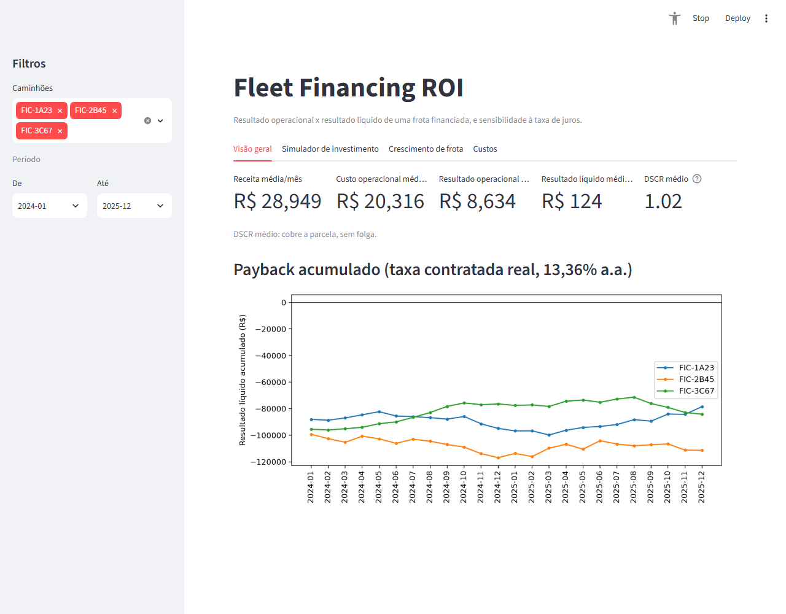
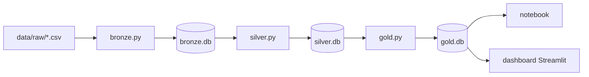

# Fleet Financing ROI

Um caminhão pode ter uma operação saudável (frete cobrindo bem combustível, motorista, manutenção) e mesmo assim não se pagar, se a taxa de juros do financiamento for alta demais. Foi essa pergunta, não uma tecnologia específica, que deu origem a este projeto.



## O problema

Depois de alguns anos acompanhando custo operacional e financeiro de frota, uma coisa ficou clara: é muito fácil avaliar um caminhão só pelo resultado da operação (frete menos combustível, pneu, seguro, motorista, ajudante, manutenção) e esquecer que a parcela do financiamento também sai do caixa todo mês. E essa parcela depende de uma variável que ninguém na operação controla: a taxa de juros contratada.

Frota nova de transporte de carga quase sempre é financiada, não comprada à vista. Um caminhão 0km completo (cavalo + implemento) gira em torno de R$ 470 mil hoje, financiado em 60 meses. Com juros de veículo pesado na faixa de 13% a.a., a parcela mensal fica pesada o suficiente pra decidir sozinha se o investimento vale a pena, independente de o caminhão "rodar bem".

Este projeto simula essa realidade pra responder três perguntas concretas:

1. Qual é o resultado *real* de cada caminhão, descontando a parcela do financiamento, não só o resultado operacional?
2. Em quantos meses ele se paga?
3. O que muda nesse cálculo se a taxa de juros fosse outra?

## Como pensei a solução

A ordem das decisões aqui foi sempre problema primeiro, ferramenta depois. Registro o raciocínio porque acho que isso importa mais do que a lista de tecnologias em si.

**Por que dados sintéticos, e não uma planilha real.** Números financeiros de uma operação real são informação sensível. Não dá pra publicar isso num repositório público. Mas a *estrutura* de como esse dado se organiza (frete recebido em parcelas ao longo do mês, categorias de custo como combustível, pneu, seguro, motorista, ajudante, manutenção, pedágio, impostos) é conhecimento de domínio que eu já tinha. `src/generate_data.py` gera dados aleatórios em cima dessa estrutura real: fiel ao formato, sem expor nenhum valor de verdade.

**Por que separar o pipeline em camadas (bronze / silver / gold).** O maior risco em qualquer pipeline de dados não é errar uma conta, é um dado inconsistente entrar direto numa análise sem ninguém perceber de onde ele veio. Separar em três estágios resolve isso: `bronze.py` guarda uma cópia fiel do dado bruto (se algo quebrar lá na frente, dá pra reprocessar sem depender da fonte original de novo); `silver.py` valida e limpa (categoria de custo fora da taxonomia, valor negativo, duplicata) sem ainda calcular nada de negócio; `gold.py` é onde receita, custo e parcela se juntam nas métricas que efetivamente respondem a pergunta (resultado líquido, custo por km, payback). Notebook e dashboard só têm permissão de ler da camada gold. Isso evita, por exemplo, um gráfico calcular receita de um jeito enquanto um KPI calcula de outro.

**Por que SQLite, e não Postgres.** O volume aqui é pequeno (3 caminhões, dois anos de dado mensal) e o objetivo é reprodutibilidade: qualquer pessoa que clonar o repositório roda o pipeline sem instalar ou configurar servidor de banco nenhum. Cada camada vira um arquivo `.db`: três arquivos, três responsabilidades.

**Por que a lógica de amortização ficou em Python, e não em SQL puro.** A tabela de amortização (sistema Price) é iterativa por natureza: o saldo devedor de um mês depende do saldo do mês anterior. Isso é direto em Python com um laço simples; forçar isso numa query SQL recursiva só complicaria sem ganhar nada. Deixei o SQL fazer o que SQL faz bem (schema, tipagem, agregação) e o Python cuidar da lógica financeira sequencial.

**Por que um dashboard Streamlit além do notebook.** Notebook é uma ferramenta de análise, não de decisão. Ninguém que precisa decidir se compra um caminhão financiado vai abrir um Jupyter. O dashboard existe pra separar essas duas coisas: quem quer entender a conta a fundo lê o notebook; quem quer testar um cenário (outro valor de entrada, outra taxa, outro caminhão) mexe num slider e vê o resultado mudar na hora, sem precisar entender o código por trás.

## O que o dashboard faz

- **Visão geral**: receita, custo, resultado operacional e líquido médios, DSCR (índice de cobertura do serviço da dívida) e a curva de payback acumulado de cada caminhão, com filtro de período e de caminhão na barra lateral.
- **Simulador de investimento**: escolhe um caminhão como base de desempenho, ajusta valor do veículo, entrada, prazo e taxa de juros, e vê a parcela, o resultado líquido, o DSCR e o payback estimado recalcularem em tempo real.
- **Crescimento de frota**: a pergunta que fica depois de entender o payback de um caminhão só. Reinvestindo a sobra mensal em caminhão novo, quantos caminhões a frota teria em N anos? O modelo simula compra e aposentadoria (vida útil configurável) mês a mês, com uma reserva de segurança configurável (em meses de parcela) guardada antes de cada compra nova. Mostra um teto financeiro, não uma previsão: assume carga suficiente pra ocupar cada caminhão novo desde o primeiro mês, o que raramente é o fator limitante real (esse costuma ser conseguir contrato e mão de obra, não capital).
- **Custos**: composição de custo por categoria, total ou por caminhão, no período selecionado.

O DSCR (resultado operacional dividido pela parcela) é o mesmo índice que banco usa pra avaliar se aprova crédito novo: abaixo de 1,0 o caminhão não cobre a própria parcela; entre 1,0 e 1,3 cobre, mas sem folga; acima de 1,3 é o patamar geralmente considerado seguro pra sustentar mais dívida. Com os números simulados aqui, os 3 caminhões ficam entre 0,93 e 1,07: nenhum tem folga real pra financiar um quarto caminhão sem melhorar a operação ou negociar uma taxa menor.

## Arquitetura



- `src/generate_data.py`: gera os CSVs sintéticos.
- `src/bronze.py`: copia os CSVs pra `bronze.db`, sem alterar nada além de tipagem.
- `src/silver.py`: limpa, valida e calcula a amortização Price. Grava em `silver.db`.
- `src/gold.py`: junta receita, custo e parcela; calcula as métricas de negócio. Grava em `gold.db`.
- `src/run_pipeline.py`: roda as três camadas em sequência.
- `src/app_streamlit.py`: dashboard interativo, lê só de `gold.db`.
- `notebooks/analise.ipynb`: a mesma análise em formato exploratório, com a simulação de sensibilidade à taxa de juros.

## Como rodar

```bash
pip install -r requirements.txt

python src/generate_data.py   # gera os CSVs em data/raw/
python src/run_pipeline.py    # bronze -> silver -> gold

sqlite3 gold.db < sql/analysis_queries.sql   # queries prontas

jupyter notebook notebooks/analise.ipynb     # gráficos + simulação de juros

streamlit run src/app_streamlit.py           # dashboard interativo
```

## O que os dados mostram

Com os caminhões a R$ 470 mil e 13,36% a.a., o resultado operacional médio fica em torno de R$ 8-9 mil por mês. Parece saudável. Mas a parcela do financiamento (R$ 8,4 a 8,7 mil/mês) consome quase tudo isso: o resultado líquido médio fica entre -R$ 641 e +R$ 605 por mês, e nenhum dos 3 caminhões recupera o valor da entrada em 24 meses.

A simulação de sensibilidade mostra por que isso importa: poucos pontos percentuais de diferença na taxa mudam o payback de "alguns anos" pra "nunca dentro do prazo do financiamento". Um caminhão bem administrado na operação pode simplesmente não se pagar, dependendo só de quanto custou o dinheiro emprestado pra comprá-lo. É justamente esse o tipo de conta que costuma ficar de fora quando a decisão de expandir frota olha apenas pro resultado operacional.

## Estrutura de pastas

```
fleet-financing-roi/
├── docs/dashboard-visao-geral.png
├── data/raw/               # CSVs sintéticos
├── src/generate_data.py
├── src/bronze.py
├── src/silver.py
├── src/gold.py
├── src/run_pipeline.py
├── src/app_streamlit.py
├── sql/*_schema.sql
├── sql/analysis_queries.sql
├── notebooks/analise.ipynb
└── requirements.txt
```
